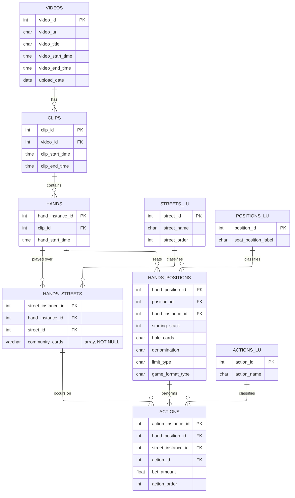

# table-talk

A conversational analytics agent over a BigQuery poker dataset. Source data is ingested from final-table poker video replays via a video-to-JSON pipeline.

**Status**: in progress. Migrating from a Colab prototype to a structured Python project with IaC, dbt, and an agentic interface.

## Data Model

The schema captures poker hand histories extracted from recorded broadcasts. A `Video` is segmented into `Clips`, each clip holds 1-N `Hands`, and each hand decomposes into per-street state (`Hands_Streets`), per-player state (`Hands_Positions`), and the individual `Actions` taken. The `*_LU` tables are lookups for streets, seat positions, and action types.

## Long-term architecture

1. **Ingestion**: `yt-dlp` downloads poker broadcasts; videos cached in GCS
2. **Extraction**: Gemini (via Vertex AI) extracts hand records as JSON
3. **Validation & shredding**: dbt validates JSON structure and shreds into a BigQuery star schema
4. **Analytics**: a conversational agent queries BigQuery via natural language

## Documentation

- [ARCHITECTURE.md](./ARCHITECTURE.md) — pipeline phases, file organization, BQ tables, failure handling per phase
- [CLAUDE.md](./CLAUDE.md) — behavioral guidelines for AI coding agents and project conventions that new code must follow

## Getting started

This project is under active development and not yet usable end-to-end. See `terrm/README.md` for infrastructure setup.
