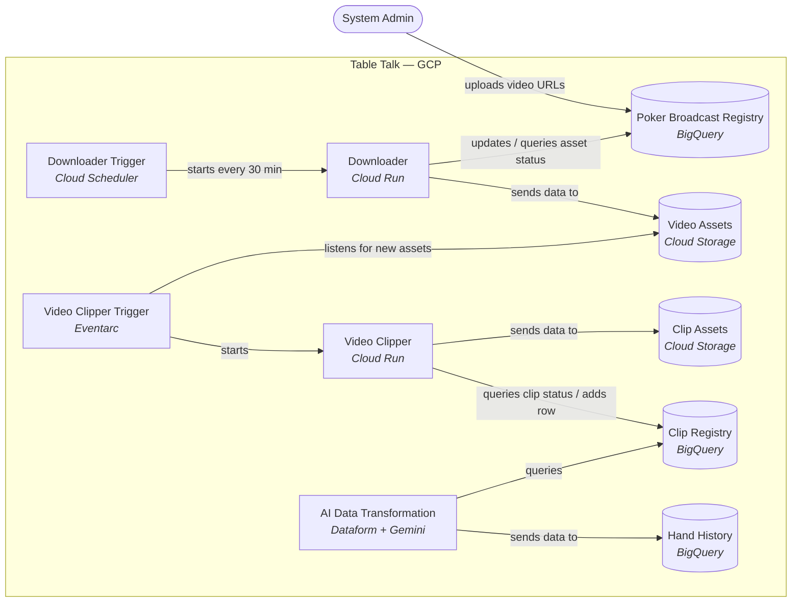
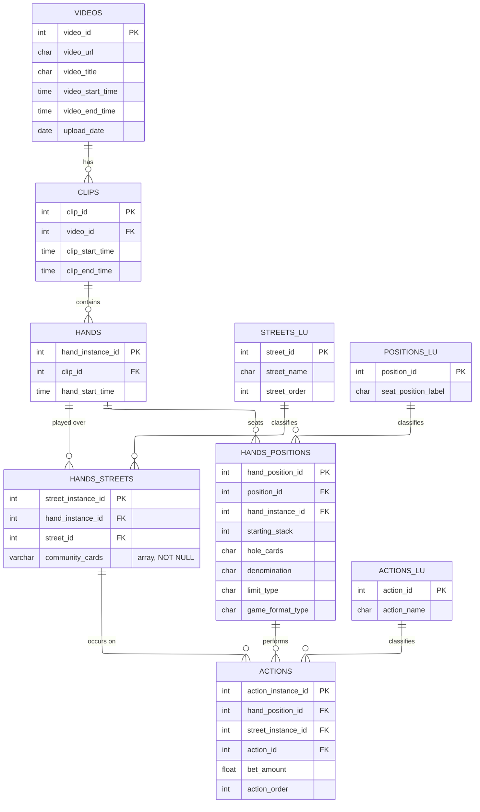

# table-talk
**Overview** Reaching a final table in a large field poker tournament is a rare opportunity to capture asymmetric upside. The 2023 WSOP Main Event illustrates how extreme poker's top-heavy payout structure is. From a record 10,043 entrants and a $93.4 million prize pool, the top 15% of the field (1,507 players) cashed, each guaranteed at least $15,000. But the nine-player final table alone claimed about $33.3 million — roughly 36% of the entire pool — despite representing under 0.1% of the field and just 0.6% of paid spots. The champion, Daniel Weinman, took $12.1 million (about 13% of the prize pool), while the remaining ~64% was spread across the other ~1,498 cashers.

**Project Motivation** KalipokerTV is a YouTube channel that posts final table replays of PokerStars' online tournaments. This channel democratizes access to tournament replays that are normally only available to tournament entrants. KalipokerTV has uploaded ~150 NL final table replay videos in 2026 so far. Assuming an average video length of 1hr and an average hand duration of 1 minute, the estimated total hands played is ~18K hands. This easily translates to 100K+ observable actions across a variety of situational dimensions - a dataset of immense analytical value due to the population tendency and trend analysis it enables. The challenge is reliably converting the raw video into structured hands. 

**Description**
- MVP-1: An AI-enabled batch processing pipeline that converts final-table poker video replays on YouTube to a dataset of structured poker hands.
- MVP-2: A multi-agent workflow that mines the MVP-1 dataset for population tendency and trend analysis. 

**MVP-1 Status**: In progress. Feasibility testing completed in Colab. Migrating from Colab prototype to a structured Python project with IaC, using Terraform. 

**MVP-2 Status**: Scaffolding for agent-to-agent communication unit-tested and integration tested. (likely to move to a standalone repo).

## System Design

Table Talk runs entirely on GCP. A scheduler kicks off the **Downloader**, which pulls poker broadcasts into storage; an Eventarc trigger then fires the **Video Clipper** to break each broadcast into hand-level clips; finally an **AI Data Transformation** step (Python + Gemini on Vertex AI) decodes those clips into structured hand details.

## Data Model

The schema captures poker hand histories extracted from recorded broadcasts. A `Video` is segmented into `Clips`, each clip holds 1-N `Hands`, and each hand decomposes into per-street state (`Hands_Streets`), per-player state (`Hands_Positions`), and the individual `Actions` taken. The `*_LU` tables are lookups for streets, seat positions, and action types.

## Documentation

- [ARCHITECTURE.md](./ARCHITECTURE.md) — pipeline phases, file organization, BQ tables, failure handling per phase
- [CLAUDE.md](./CLAUDE.md) — behavioral guidelines for AI coding agents and project conventions that new code must follow

## Getting started

This project is under active development and not yet usable end-to-end. See `terraform/README.md` for infrastructure setup.
